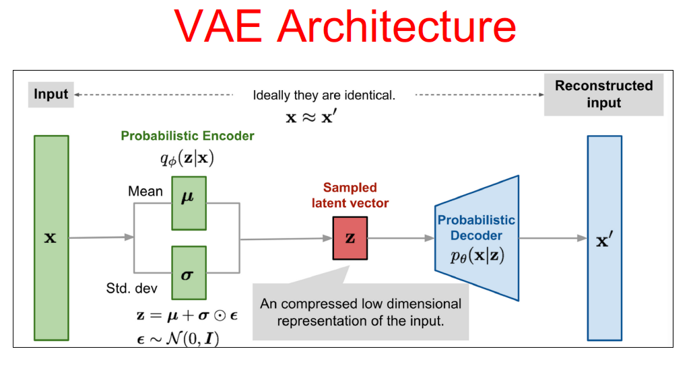

# variational Autoencoder
A variational autoencoder is similar to a regular autoencoder except that it is a generative model. This “generative” aspect stems from placing an additional constraint on the loss function such that the latent space is spread out and doesn’t contain dead zones where reconstructing an input from those locations results in garbage. By doing this, we can randomly sample a vector from the latent space and hopefully create a meaninful decoded output from it.  
The “variational” part comes from the fact that we’re trying to approximate the posterior distribution pθ(z|x) with a variational distribution qϕ(z|x). Thus, the encoder outputs parameters to this variational distribution which is just a multivariate Gaussian distribution, and the latent representation is obtained by then sampling this distribution. The decoder then takes the latent representation and tries to reconstruct the original input from it.  

  

Applications of variational Autoencoder: 
* Dimensionality Reduction
* Image Compression
* Image Denoising
* Feature Extraction
* Image generation
* Sequence to sequence prediction
* Recommendation system

## Variational Autoencoder in Text  
In this sub project, VAE architecture is applied on IMDB dataset of Keras. The movie reviews are reconstructed by VAE and simultaneously sentiments are predicted.
In model 3 distinct components are implemented:  
1-A bidirectional RNN encoder  
2-A simple linear single-layer fully-connected classification network  
3-An RNN decoder  
The choice to have a bidirectional RNN encoder has to do with RNNs being better able to represent the more recent parts of the input sequence in their hidden states. By using a bidirectional RNN where the hidden states are concatenated, we mitigate the issue of not being able to remember the earliest parts of the sequence.

**Note 1: Incosistency error happened between Tensorflow 2.4.1 and Numpy 1.20. So, downgrade your Numpy to 1.18.5  
Note 2: By using keras 2.4.3, I couldn't add custom loss function because of this version. So, I simply used tf.keras.losses.KLDivergence to calculate the loss.**

sources:
https://towardsdatascience.com/understanding-variational-autoencoders-vaes-f70510919f73  
https://towardsdatascience.com/intuitively-understanding-variational-autoencoders-1bfe67eb5daf  
http://alexadam.ca/ml/2017/05/05/keras-vae.html  
https://www.jeremyjordan.me/variational-autoencoders/

